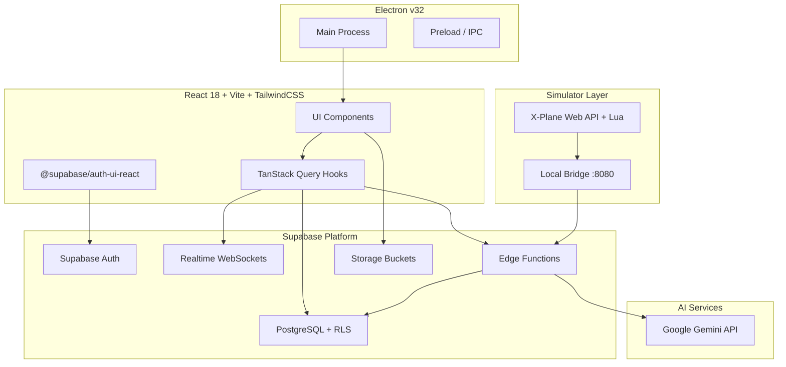
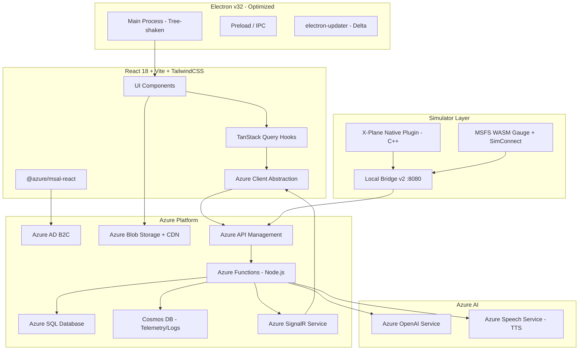
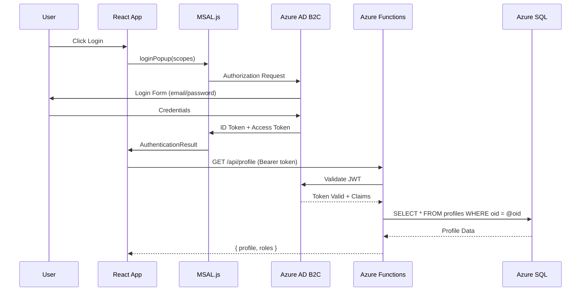
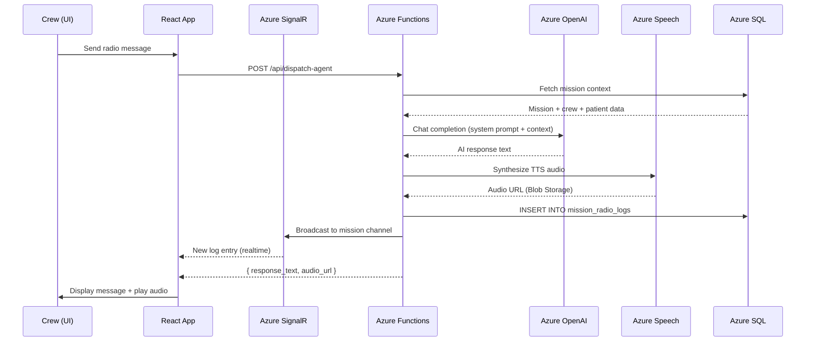
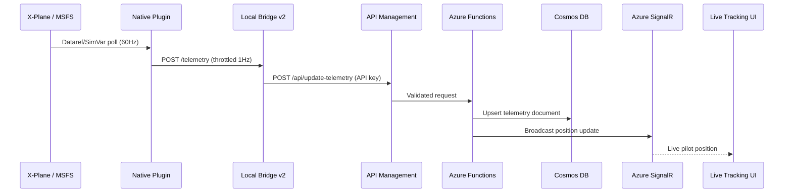

# Design Document: Azure Platform Migration

## Overview

The HEMS Ops Center is a full-stack Helicopter Emergency Medical Services operations platform currently built on Supabase (PostgreSQL, Auth, Edge Functions, Realtime, Storage) with a React 18 + Vite + TypeScript frontend, an Electron v32 desktop app, simulator plugins (X-Plane, MSFS), and an AI dispatch agent powered by Gemini via Supabase Edge Functions.

This migration replaces every Supabase dependency with Azure-native equivalents while preserving the existing frontend design, component structure, and user experience. The five pillars of this migration are: (1) Data layer → Azure SQL + Cosmos DB, (2) Auth → Azure AD B2C, (3) Serverless functions → Azure Functions, (4) Realtime → Azure SignalR Service, (5) Storage → Azure Blob Storage. Additionally, the Electron app will be optimized for smaller GitHub release artifacts, simulator plugins will be overhauled to use native SDKs, and the AI agent will be redesigned on Azure OpenAI Service.

The migration follows a strangler-fig pattern: a new Azure API layer is introduced behind a unified client abstraction, allowing incremental hook-by-hook migration with feature flags, zero-downtime cutover, and rollback capability.

## Architecture

### Current Architecture (Supabase)



### Target Architecture (Azure)



## Sequence Diagrams

### Authentication Flow (Azure AD B2C)



### Mission Dispatch with AI Agent



### Telemetry Pipeline (Simulator → Cloud)



## Components and Interfaces

### Component 1: Azure Client Abstraction Layer

**Purpose**: Drop-in replacement for the Supabase client. Provides a unified API surface that all hooks consume, enabling incremental migration with feature flags.

```typescript
// src/integrations/azure/client.ts
interface AzureClient {
  auth: AzureAuthClient;
  db: AzureDatabaseClient;
  realtime: AzureRealtimeClient;
  storage: AzureStorageClient;
  functions: AzureFunctionsClient;
}

interface AzureAuthClient {
  getSession(): Promise<{ token: string; user: AzureUser } | null>;
  signIn(): Promise<AuthResult>;
  signOut(): Promise<void>;
  onAuthStateChange(callback: (user: AzureUser | null) => void): () => void;
}

interface AzureDatabaseClient {
  from(table: string): QueryBuilder;
}

interface QueryBuilder {
  select(columns?: string): QueryBuilder;
  insert(data: Record<string, unknown> | Record<string, unknown>[]): QueryBuilder;
  update(data: Record<string, unknown>): QueryBuilder;
  delete(): QueryBuilder;
  upsert(data: Record<string, unknown>, options?: { onConflict: string }): QueryBuilder;
  eq(column: string, value: unknown): QueryBuilder;
  in(column: string, values: unknown[]): QueryBuilder;
  gt(column: string, value: unknown): QueryBuilder;
  order(column: string, options?: { ascending: boolean }): QueryBuilder;
  limit(count: number): QueryBuilder;
  single(): QueryBuilder;
  execute(): Promise<{ data: unknown; error: Error | null }>;
}

interface AzureRealtimeClient {
  subscribe(channel: string, table: string, filter?: string, callback: (payload: unknown) => void): Subscription;
  unsubscribe(subscription: Subscription): void;
}

interface AzureStorageClient {
  getPublicUrl(container: string, blobPath: string): string;
  upload(container: string, blobPath: string, file: File): Promise<string>;
}

interface AzureFunctionsClient {
  invoke(functionName: string, options: { method: string; body?: unknown }): Promise<Response>;
}
```

**Responsibilities**:
- Wrap MSAL.js for authentication token acquisition
- Translate Supabase-style query builder calls into Azure Functions REST API calls
- Manage SignalR connections for realtime subscriptions
- Provide Blob Storage URL generation with CDN prefix

### Component 2: Azure AD B2C Authentication

**Purpose**: Replace Supabase Auth with Azure AD B2C, maintaining email/password login and JWT-based API authorization.

```typescript
// src/integrations/azure/auth.ts
interface AzureUser {
  id: string;           // B2C Object ID (oid claim)
  email: string;
  displayName: string;
  roles: string[];      // From custom claims or user_roles table
}

interface AuthResult {
  user: AzureUser;
  accessToken: string;
  idToken: string;
  expiresOn: Date;
}

interface B2CConfig {
  clientId: string;
  authority: string;     // https://{tenant}.b2clogin.com/{tenant}.onmicrosoft.com/{policy}
  knownAuthorities: string[];
  redirectUri: string;
  scopes: string[];      // API scopes for Azure Functions
}
```

**Responsibilities**:
- MSAL.js popup/redirect login flows
- Silent token renewal
- Custom B2C user flows for sign-up, sign-in, password reset
- Map B2C claims to application user model
- Provide AuthProvider React context (replaces Supabase AuthProvider)

### Component 3: Azure Functions API Layer

**Purpose**: Replace all Supabase Edge Functions and provide a REST API for database operations (replacing direct Supabase client queries).

```typescript
// Azure Functions structure
interface FunctionEndpoints {
  // CRUD endpoints (replace direct Supabase queries)
  'GET    /api/hospitals':           () => Hospital[];
  'GET    /api/helicopters':         () => Helicopter[];
  'GET    /api/hems-bases':          () => HemsBase[];
  'GET    /api/missions':            (query: { userId?: string; status?: string }) => Mission[];
  'GET    /api/missions/:id':        (params: { id: string }) => Mission;
  'POST   /api/missions':            (body: MissionInput) => Mission;
  'PATCH  /api/missions/:id':        (body: Partial<Mission>) => Mission;
  'GET    /api/profiles':            () => Profile[];
  'PATCH  /api/profiles/:id':        (body: Partial<Profile>) => Profile;
  'GET    /api/config':              () => ConfigItem[];
  'PUT    /api/config':              (body: ConfigItem) => ConfigItem;
  'GET    /api/achievements/:userId': () => Achievement[];
  'POST   /api/achievements':        (body: { type: string }) => Achievement;
  'GET    /api/community-posts':     () => CommunityPost[];
  'POST   /api/community-posts':     (body: PostInput) => CommunityPost;
  'DELETE /api/community-posts/:id': () => void;
  'GET    /api/incident-reports':    () => IncidentReport[];
  'POST   /api/incident-reports':    (body: ReportInput) => IncidentReport;
  'PATCH  /api/incident-reports/:id': (body: { resolution: string }) => void;
  'GET    /api/notams':              () => Notam[];
  'POST   /api/notams':              (body: NotamInput) => Notam;
  'PATCH  /api/notams/:id':          (body: { active: boolean }) => void;
  'GET    /api/downloads':           () => DownloadItem[];
  'POST   /api/downloads':           (body: DownloadInput) => DownloadItem;
  'DELETE /api/downloads/:id':       () => void;
  'GET    /api/live-pilots':         () => LivePilot[];
  'GET    /api/user-roles/:userId':  () => string[];
  'GET    /api/logs':                () => LogEntry[];
  'POST   /api/logs':                (body: LogInput) => void;

  // Mission radio logs (with SignalR broadcast)
  'GET    /api/mission-logs/:missionId': () => RadioLog[];
  'POST   /api/mission-logs':            (body: RadioLogInput) => RadioLog;
  'GET    /api/global-dispatch-logs':    () => RadioLog[];
  'POST   /api/global-dispatch-logs':    (body: RadioLogInput) => RadioLog;

  // AI endpoints (replace Supabase Edge Functions)
  'POST   /api/dispatch-agent':      (body: { mission_id: string; crew_message: string }) => DispatchResponse;
  'POST   /api/tactical-analyst':    (body: { mode: string; context: unknown }) => AnalystResponse;
  'POST   /api/generate-tts-audio':  (body: { text: string }) => { audio_url: string };

  // Telemetry (high-frequency, writes to Cosmos DB)
  'POST   /api/update-telemetry':    (body: TelemetryPayload) => void;
  'GET    /api/telemetry-summary':   () => TelemetrySummary[];

  // Simulator-specific
  'GET    /api/active-missions':     () => SimulatorMission[];
  'POST   /api/mission-details':     (body: { mission_id: string }) => MissionContext;
  'POST   /api/hospital-scenery':    (body: { hospital_id: string }) => SceneryData;
}
```

**Responsibilities**:
- JWT validation via Azure AD B2C middleware
- Role-based access control (replaces RLS policies)
- Database queries via `@azure/sql` or Prisma
- SignalR message broadcasting on data mutations
- API key authentication for bridge/simulator endpoints

### Component 4: Azure SignalR Realtime Service

**Purpose**: Replace Supabase Realtime `postgres_changes` subscriptions with Azure SignalR for live radio feeds, telemetry, and pilot positions.

```typescript
// src/integrations/azure/realtime.ts
interface SignalRChannels {
  'mission-radio:{missionId}':  RadioLog;      // Per-mission radio feed
  'global-dispatch':            RadioLog;      // Global dispatch feed
  'telemetry:{missionId}':      TelemetryData; // Live telemetry stream
  'pilot-positions':            LivePilot;     // Global pilot map updates
}

interface SignalRManager {
  connect(accessToken: string): Promise<void>;
  joinGroup(group: string): Promise<void>;
  leaveGroup(group: string): Promise<void>;
  on<T>(event: string, callback: (data: T) => void): void;
  off(event: string): void;
  disconnect(): Promise<void>;
}
```

**Responsibilities**:
- Negotiate SignalR connection via Azure Functions endpoint
- Manage group subscriptions (per-mission channels)
- Auto-reconnect with exponential backoff
- Replace all `supabase.channel()` and `postgres_changes` subscriptions

### Component 5: Optimized Electron App

**Purpose**: Reduce Electron app bundle size for GitHub releases while maintaining full functionality.

```typescript
// electron/main.ts - Optimized configuration
interface ElectronOptimizations {
  // Build optimizations
  asar: true;                          // Compress app into asar archive
  compression: 'maximum';              // Maximum NSIS compression
  architectures: ['x64'];             // Drop ia32 (32-bit) support
  electronVersion: '32.x';            // Pin to specific version

  // Runtime optimizations
  nodeIntegration: false;
  contextIsolation: true;
  sandbox: true;                       // Enable renderer sandbox

  // Delta updates
  publish: {
    provider: 'github';
    releaseType: 'release';
  };
  differentialDownload: true;          // Only download changed blocks
}
```

**Responsibilities**:
- Remove ia32 architecture target (saves ~60MB per platform)
- Enable maximum NSIS compression
- Implement electron-updater for delta updates
- Tree-shake unused Electron modules
- Lazy-load heavy renderer dependencies


## Data Models

### Model 1: Azure SQL Schema (Relational Data)

All existing Supabase PostgreSQL tables migrate to Azure SQL with minimal schema changes. Snake_case column names are preserved for backward compatibility with existing mapping functions.

```typescript
// Core operational tables - Azure SQL
interface HospitalRow {
  id: string;                    // UUID, PRIMARY KEY
  name: string;
  city: string;
  faa_identifier: string | null;
  latitude: number;              // DECIMAL(10,7)
  longitude: number;             // DECIMAL(10,7)
  is_trauma_center: boolean;
  trauma_level: number | null;
  created_at: string;            // DATETIME2, DEFAULT GETUTCDATE()
}

interface HelicopterRow {
  id: string;
  model: string;
  registration: string;          // UNIQUE
  fuel_capacity_lbs: number;
  cruise_speed_kts: number;
  fuel_burn_rate_lb_hr: number;
  image_url: string | null;
  maintenance_status: 'FMC' | 'AOG';
  created_at: string;
}

interface HemsBaseRow {
  id: string;
  name: string;
  location: string;
  contact: string | null;
  faa_identifier: string | null;
  latitude: number;
  longitude: number;
  helicopter_id: string | null;  // FK → helicopters.id
  created_at: string;
}

interface MissionRow {
  id: string;
  mission_id: string;            // UNIQUE, application-level ID
  user_id: string;               // B2C Object ID
  callsign: string;
  mission_type: 'Scene Call' | 'Hospital Transfer';
  status: 'active' | 'completed' | 'cancelled';
  hems_base: object;             // NVARCHAR(MAX) JSON
  helicopter: object;            // NVARCHAR(MAX) JSON
  crew: object;                  // NVARCHAR(MAX) JSON
  origin: object;
  pickup: object | null;
  destination: object;
  patient_age: number | null;
  patient_gender: string;
  patient_weight_lbs: number | null;
  patient_details: string | null;
  medical_response: string | null;
  waypoints: object;             // NVARCHAR(MAX) JSON array
  tracking: object;              // NVARCHAR(MAX) JSON
  live_data: object;             // NVARCHAR(MAX) JSON
  pilot_notes: string | null;
  performance_score: number | null;
  flight_summary: object | null;
  created_at: string;
}

interface ProfileRow {
  id: string;                    // B2C Object ID
  first_name: string | null;
  last_name: string | null;
  avatar_url: string | null;
  location: string | null;
  email_public: string | null;
  simulators: string | null;
  experience: string | null;
  bio: string | null;
  social_links: object | null;   // NVARCHAR(MAX) JSON
  is_subscribed: boolean;
  updated_at: string;
}

interface UserRoleRow {
  id: string;
  user_id: string;               // B2C Object ID
  role_id: string;               // 'admin', 'pilot', 'dispatcher'
}

// Additional tables: achievements, community_posts, incident_reports,
// notams, downloads, config, content_pages, base_scenery, hospital_scenery,
// logs — all follow same pattern with UUID PKs and DATETIME2 timestamps
```

**Validation Rules**:
- All UUIDs generated server-side via `NEWID()` or application-level `crypto.randomUUID()`
- JSON columns validated at the Azure Functions layer before INSERT
- `mission_id` has UNIQUE constraint for idempotent mission creation
- `user_id` references B2C Object ID (no FK to auth table — validated at API layer)
- Latitude/longitude stored as DECIMAL(10,7) for ~1cm precision

### Model 2: Cosmos DB Documents (High-Frequency Data)

Telemetry and live pilot status move to Cosmos DB for low-latency writes and automatic TTL expiration.

```typescript
// Cosmos DB - Telemetry container
// Partition key: /mission_id
// TTL: 86400 (24 hours for raw telemetry)
interface TelemetryDocument {
  id: string;                    // Auto-generated
  mission_id: string;            // Partition key
  user_id: string;
  latitude: number;
  longitude: number;
  altitude_ft: number;
  ground_speed_kts: number;
  heading_deg: number;
  vertical_speed_ft_min: number;
  fuel_remaining_lbs: number;
  phase: string;
  engine_status: string;
  timestamp: number;             // Unix epoch ms
  _ts: number;                   // Cosmos auto-timestamp
}

// Cosmos DB - Live Pilot Status container
// Partition key: /user_id
// TTL: 900 (15 minutes — auto-expire stale pilots)
interface LivePilotDocument {
  id: string;                    // = user_id (upsert by user)
  user_id: string;               // Partition key
  callsign: string;
  latitude: number;
  longitude: number;
  altitude_ft: number;
  ground_speed_kts: number;
  heading_deg: number;
  fuel_remaining_lbs: number;
  phase: string;
  last_seen: string;             // ISO 8601
  _ts: number;
}

// Cosmos DB - Telemetry Summary container (materialized view)
// Partition key: /mission_id
// Updated by Azure Function on each telemetry write
interface TelemetrySummaryDocument {
  id: string;                    // = mission_id
  mission_id: string;
  latitude: number;
  longitude: number;
  phase: string;
  fuel_remaining_lbs: number;
  last_update: number;
}
```

**Validation Rules**:
- Partition keys chosen for even distribution and query patterns
- TTL on raw telemetry prevents unbounded storage growth
- Live pilot documents auto-expire after 15 minutes of inactivity (replaces the `gt('last_seen', bufferTime)` query)
- Telemetry summary is a single document per mission, upserted on each telemetry write


## Key Functions with Formal Specifications

### Function 1: createAzureClient()

```typescript
function createAzureClient(config: AzureClientConfig): AzureClient
```

**Preconditions:**
- `config.apiBaseUrl` is a valid HTTPS URL pointing to Azure API Management
- `config.b2cConfig` contains valid tenant, clientId, and policy identifiers
- `config.signalrEndpoint` is a valid SignalR negotiate endpoint
- `config.storageBaseUrl` is a valid Azure Blob Storage CDN URL

**Postconditions:**
- Returns a fully initialized `AzureClient` instance
- MSAL PublicClientApplication is configured but not yet authenticated
- SignalR connection is not yet established (lazy connect on first subscribe)
- All query builder methods are available and will throw if called without auth

**Loop Invariants:** N/A

### Function 2: migrateHookToAzure()

```typescript
function migrateHookToAzure<T>(
  hookName: string,
  supabaseImpl: () => T,
  azureImpl: () => T,
  featureFlag: string
): () => T
```

**Preconditions:**
- Both `supabaseImpl` and `azureImpl` are valid React hooks with identical return types
- `featureFlag` exists in the config table / environment
- Feature flag value is 'supabase' | 'azure' | 'shadow' (shadow = run both, compare)

**Postconditions:**
- When flag = 'supabase': returns `supabaseImpl()` result
- When flag = 'azure': returns `azureImpl()` result
- When flag = 'shadow': returns `supabaseImpl()` result but also runs `azureImpl()` and logs discrepancies
- No user-visible behavior change during shadow mode

**Loop Invariants:** N/A

### Function 3: handleTelemetryUpdate()

```typescript
// Azure Function: update-telemetry
async function handleTelemetryUpdate(
  req: HttpRequest,
  cosmosClient: CosmosClient,
  signalrClient: SignalRClient
): Promise<HttpResponse>
```

**Preconditions:**
- Request contains valid API key or Bearer token
- Request body contains `mission_id`, `latitude`, `longitude`, `fuel_remaining_lbs`
- `mission_id` corresponds to an active mission in Azure SQL

**Postconditions:**
- New telemetry document created in Cosmos DB telemetry container
- Telemetry summary document upserted in summary container
- Live pilot status document upserted in live_pilot_status container
- SignalR message broadcast to `telemetry:{mission_id}` and `pilot-positions` groups
- Returns HTTP 200 on success, 401 on auth failure, 400 on validation failure

**Loop Invariants:** N/A

### Function 4: handleDispatchAgent()

```typescript
// Azure Function: dispatch-agent
async function handleDispatchAgent(
  req: HttpRequest,
  sqlClient: SqlClient,
  openaiClient: OpenAIClient,
  speechClient: SpeechClient,
  signalrClient: SignalRClient
): Promise<HttpResponse>
```

**Preconditions:**
- Request contains valid Bearer token with authenticated user
- `mission_id` references an active mission owned by or accessible to the user
- `crew_message` is a non-empty string, max 2000 characters
- Azure OpenAI deployment is available and responding

**Postconditions:**
- Mission context (crew, patient, waypoints, phase) fetched from Azure SQL
- AI response generated via Azure OpenAI chat completion
- TTS audio synthesized via Azure Speech Service and stored in Blob Storage
- Radio log entry inserted into Azure SQL `mission_radio_logs`
- SignalR broadcast sent to `mission-radio:{missionId}` group
- Returns `{ response_text: string, audio_url: string }`
- On AI failure: returns fallback "Dispatch unavailable" message with no audio

**Loop Invariants:** N/A

### Function 5: negotiateSignalR()

```typescript
// Azure Function: negotiate (SignalR binding)
async function negotiateSignalR(
  req: HttpRequest,
  connectionInfo: SignalRConnectionInfo
): Promise<HttpResponse>
```

**Preconditions:**
- Request contains valid Bearer token
- User ID extracted from token claims

**Postconditions:**
- Returns SignalR connection info with user-scoped access token
- Connection info includes endpoint URL and access token
- Token scoped to user's allowed groups based on role

**Loop Invariants:** N/A

## Algorithmic Pseudocode

### Migration Cutover Algorithm

```typescript
// Strangler-fig migration: incremental hook-by-hook cutover
ALGORITHM migratePlatform(hooks: HookDefinition[], config: MigrationConfig)
INPUT: hooks — array of all Supabase-dependent hooks, config — migration flags
OUTPUT: fully migrated application with all hooks on Azure

BEGIN
  // Phase 1: Shadow mode — run both backends, compare results
  FOR EACH hook IN hooks DO
    ASSERT hook.supabaseImpl IS defined
    ASSERT hook.azureImpl IS defined

    SET config.featureFlags[hook.name] = 'shadow'
    DEPLOY application
    MONITOR discrepancy_logs FOR 48 hours

    IF discrepancy_rate(hook.name) > 0.01 THEN
      INVESTIGATE and FIX azureImpl
      RESTART shadow period for hook
    END IF
  END FOR

  // Phase 2: Incremental cutover — switch hooks one at a time
  FOR EACH hook IN hooks ORDERED BY risk ASC DO
    SET config.featureFlags[hook.name] = 'azure'
    DEPLOY application
    MONITOR error_rate(hook.name) FOR 24 hours

    IF error_rate(hook.name) > baseline * 1.5 THEN
      ROLLBACK: SET config.featureFlags[hook.name] = 'supabase'
      ALERT engineering team
      BREAK
    END IF
  END FOR

  // Phase 3: Cleanup — remove Supabase code
  FOR EACH hook IN hooks DO
    ASSERT config.featureFlags[hook.name] = 'azure'
    REMOVE hook.supabaseImpl
    REMOVE feature flag wrapper
  END FOR

  REMOVE @supabase/* dependencies from package.json
  REMOVE src/integrations/supabase/ directory

  RETURN migrated application
END
```

**Preconditions:**
- All Azure infrastructure provisioned and tested
- All Azure Function endpoints deployed and passing integration tests
- Data migration from Supabase PostgreSQL to Azure SQL completed
- Storage assets copied from Supabase Storage to Azure Blob Storage

**Postconditions:**
- All hooks consume Azure backend exclusively
- No Supabase dependencies remain in the codebase
- Zero data loss during migration
- Application behavior identical to pre-migration

**Loop Invariants:**
- At any point during migration, the application is fully functional
- Each hook is served by exactly one backend (supabase, azure, or shadow)
- Rollback to previous state is possible within 5 minutes

### Realtime Subscription Migration Algorithm

```typescript
ALGORITHM migrateRealtimeSubscription(
  table: string,
  filter: string | null,
  callback: (payload: unknown) => void
)
INPUT: Supabase realtime subscription parameters
OUTPUT: Equivalent Azure SignalR subscription

BEGIN
  // Map Supabase channel patterns to SignalR groups
  signalrGroup = MATCH table WITH
    'mission_radio_logs' WHERE filter contains mission_id:
      RETURN `mission-radio:${extractMissionId(filter)}`
    'global_dispatch_logs':
      RETURN 'global-dispatch'
    'telemetry_summary':
      RETURN 'telemetry-updates'
    'live_pilot_status':
      RETURN 'pilot-positions'
    DEFAULT:
      RETURN `table-changes:${table}`
  END MATCH

  // Establish SignalR connection if not connected
  IF NOT signalrManager.isConnected THEN
    token = AWAIT azureClient.auth.getSession().token
    AWAIT signalrManager.connect(token)
  END IF

  // Join group and register callback
  AWAIT signalrManager.joinGroup(signalrGroup)
  signalrManager.on(signalrGroup, callback)

  // Return cleanup function (mirrors supabase.removeChannel)
  RETURN () => {
    signalrManager.off(signalrGroup)
    signalrManager.leaveGroup(signalrGroup)
  }
END
```

**Preconditions:**
- SignalR negotiate endpoint is available
- User has valid authentication token
- SignalR Service is provisioned with sufficient unit capacity

**Postconditions:**
- Client receives real-time updates equivalent to Supabase postgres_changes
- Cleanup function properly removes subscription on component unmount
- No memory leaks from orphaned SignalR connections


## Example Usage

### Example 1: Migrated Hook (useHemsData → Azure)

```typescript
// src/hooks/useHemsData.ts — After migration
import { useQuery } from '@tanstack/react-query';
import { azureClient } from '@/integrations/azure/client';
import { Hospital, HemsBase, Helicopter } from '@/data/hemsData';

const fetchHospitals = async (): Promise<Hospital[]> => {
  const response = await azureClient.functions.invoke('hospitals', { method: 'GET' });
  if (!response.ok) throw new Error('Failed to fetch hospitals');
  const data = await response.json();
  return data as Hospital[];
};

const fetchHelicopters = async (): Promise<Helicopter[]> => {
  const response = await azureClient.functions.invoke('helicopters', { method: 'GET' });
  if (!response.ok) throw new Error('Failed to fetch helicopters');
  return await response.json();
};

const fetchHemsBases = async (): Promise<HemsBase[]> => {
  const response = await azureClient.functions.invoke('hems-bases', { method: 'GET' });
  if (!response.ok) throw new Error('Failed to fetch bases');
  return await response.json();
};

export const useHemsData = () => {
  const hospitalsQuery = useQuery({ queryKey: ['hospitals'], queryFn: fetchHospitals });
  const basesQuery = useQuery({ queryKey: ['hemsBases'], queryFn: fetchHemsBases });
  const helicoptersQuery = useQuery({ queryKey: ['helicopters'], queryFn: fetchHelicopters });

  return {
    hospitals: hospitalsQuery.data || [],
    bases: basesQuery.data || [],
    helicopters: helicoptersQuery.data || [],
    isLoading: hospitalsQuery.isLoading || basesQuery.isLoading || helicoptersQuery.isLoading,
    isError: hospitalsQuery.isError || basesQuery.isError || helicoptersQuery.isError,
    error: hospitalsQuery.error || basesQuery.error || helicoptersQuery.error,
    refetch: () => {
      hospitalsQuery.refetch();
      basesQuery.refetch();
      helicoptersQuery.refetch();
    }
  };
};
```

### Example 2: SignalR Realtime Subscription (replacing Supabase Realtime)

```typescript
// src/hooks/useMissionLogs.ts — After migration
import { useState, useEffect, useCallback } from 'react';
import { azureClient } from '@/integrations/azure/client';
import { signalrManager } from '@/integrations/azure/realtime';
import { toast } from 'sonner';

export const useMissionLogs = (missionId?: string, isGlobal: boolean = false) => {
  const [logs, setLogs] = useState<LogEntry[]>([]);
  const [isLoading, setIsLoading] = useState(true);

  const fetchLogs = useCallback(async () => {
    setIsLoading(true);
    const endpoint = isGlobal ? 'global-dispatch-logs' : `mission-logs/${missionId}`;
    const response = await azureClient.functions.invoke(endpoint, { method: 'GET' });
    if (response.ok) setLogs(await response.json());
    setIsLoading(false);
  }, [missionId, isGlobal]);

  useEffect(() => { fetchLogs(); }, [fetchLogs]);

  // SignalR subscription (replaces supabase.channel + postgres_changes)
  useEffect(() => {
    const group = isGlobal ? 'global-dispatch' : `mission-radio:${missionId}`;
    if (!isGlobal && !missionId) return;

    signalrManager.joinGroup(group);
    signalrManager.on(group, (newLog: LogEntry) => {
      setLogs(prev => {
        if (prev.some(log => log.id === newLog.id)) return prev;
        return [...prev, newLog];
      });
    });

    return () => {
      signalrManager.off(group);
      signalrManager.leaveGroup(group);
    };
  }, [missionId, isGlobal]);

  const addLog = async (sender: LogEntry['sender'], message: string, callsign?: string) => {
    const session = await azureClient.auth.getSession();
    if (!session?.user) return;

    const tempId = `temp-${Date.now()}`;
    const newLog: LogEntry = { id: tempId, sender, message, timestamp: new Date().toISOString(), callsign, user_id: session.user.id };
    setLogs(prev => [...prev, newLog]);

    const endpoint = isGlobal ? 'global-dispatch-logs' : 'mission-logs';
    const body = { sender, message, user_id: session.user.id, callsign, ...(missionId && { mission_id: missionId }) };
    const response = await azureClient.functions.invoke(endpoint, { method: 'POST', body });

    if (!response.ok) {
      setLogs(prev => prev.filter(log => log.id !== tempId));
      toast.error("Failed to send message.");
    }
  };

  return { logs, isLoading, addLog };
};
```

### Example 3: Azure AD B2C Auth Provider (replacing Supabase Auth)

```typescript
// src/integrations/azure/AuthProvider.tsx
import { MsalProvider, useMsal, useIsAuthenticated } from '@azure/msal-react';
import { PublicClientApplication, InteractionStatus } from '@azure/msal-browser';
import { createContext, useContext, useEffect, useState, ReactNode } from 'react';

const msalConfig = {
  auth: {
    clientId: import.meta.env.VITE_AZURE_B2C_CLIENT_ID,
    authority: import.meta.env.VITE_AZURE_B2C_AUTHORITY,
    knownAuthorities: [import.meta.env.VITE_AZURE_B2C_KNOWN_AUTHORITY],
    redirectUri: window.location.origin,
  },
  cache: { cacheLocation: 'localStorage', storeAuthStateInCookie: false },
};

const msalInstance = new PublicClientApplication(msalConfig);

interface AuthContextType {
  user: AzureUser | null;
  isLoading: boolean;
  signIn: () => Promise<void>;
  signOut: () => Promise<void>;
}

const AuthContext = createContext<AuthContextType | null>(null);

export const AzureAuthProvider = ({ children }: { children: ReactNode }) => (
  <MsalProvider instance={msalInstance}>
    <AuthContextInner>{children}</AuthContextInner>
  </MsalProvider>
);

const AuthContextInner = ({ children }: { children: ReactNode }) => {
  const { instance, accounts, inProgress } = useMsal();
  const isAuthenticated = useIsAuthenticated();
  const [user, setUser] = useState<AzureUser | null>(null);

  useEffect(() => {
    if (isAuthenticated && accounts[0]) {
      setUser({
        id: accounts[0].localAccountId,
        email: accounts[0].username,
        displayName: accounts[0].name || '',
        roles: [],
      });
    } else {
      setUser(null);
    }
  }, [isAuthenticated, accounts]);

  const signIn = async () => {
    await instance.loginPopup({ scopes: [import.meta.env.VITE_AZURE_API_SCOPE] });
  };

  const signOut = async () => {
    await instance.logoutPopup();
  };

  return (
    <AuthContext.Provider value={{ user, isLoading: inProgress !== InteractionStatus.None, signIn, signOut }}>
      {children}
    </AuthContext.Provider>
  );
};

export const useAuth = () => {
  const ctx = useContext(AuthContext);
  if (!ctx) throw new Error('useAuth must be used within AzureAuthProvider');
  return ctx;
};
```

### Example 4: Optimized Electron Builder Config

```json
{
  "productName": "HEMS Ops Center",
  "appId": "com.hems.opscenter",
  "asar": true,
  "compression": "maximum",
  "directories": { "output": "release", "buildResources": "public" },
  "files": ["dist", "dist-electron"],
  "win": {
    "target": [{ "target": "nsis", "arch": ["x64"] }],
    "icon": "public/favicon.ico"
  },
  "nsis": {
    "oneClick": false,
    "allowToChangeInstallationDirectory": true,
    "differentialPackage": true
  },
  "mac": {
    "target": [{ "target": "dmg", "arch": ["arm64", "x64"] }],
    "category": "public.app-category.utilities"
  },
  "publish": [{ "provider": "github", "owner": "SheaPatterson", "repo": "HEMS", "releaseType": "release" }]
}
```


## Correctness Properties

The following properties must hold true throughout and after the migration:

1. **Data Integrity**: ∀ record R in Supabase PostgreSQL, ∃ equivalent record R' in Azure SQL such that all non-system fields are identical after type coercion (JSONB → NVARCHAR(MAX) JSON, timestamptz → DATETIME2).

2. **Authentication Equivalence**: ∀ user U who could authenticate via Supabase Auth, U can authenticate via Azure AD B2C with the same email/password credentials and receive equivalent access permissions.

3. **API Parity**: ∀ Supabase query Q executed by hook H, the equivalent Azure Functions API call returns data with identical structure and semantics (field names, types, sort order, filter behavior).

4. **Realtime Equivalence**: ∀ Supabase Realtime subscription S on table T with filter F, the equivalent SignalR subscription delivers messages with latency ≤ 2× the Supabase baseline and zero message loss under normal conditions.

5. **Storage URL Continuity**: ∀ asset A referenced by public URL in Supabase Storage, A is accessible via Azure Blob Storage CDN URL, and all hardcoded Supabase storage URLs in the codebase are replaced.

6. **Hook Return Type Stability**: ∀ hook H, the TypeScript return type of H is identical before and after migration. No component that consumes H requires modification.

7. **Telemetry Throughput**: The Azure telemetry pipeline (Bridge → API Management → Azure Function → Cosmos DB → SignalR) sustains ≥ 1 update/second per active mission with p99 latency ≤ 500ms.

8. **Electron Bundle Size**: The optimized Electron build produces artifacts where Windows NSIS installer ≤ 85MB (down from ~150MB with ia32) and macOS DMG ≤ 90MB.

9. **AI Response Quality**: The Azure OpenAI dispatch agent produces responses that are contextually equivalent to the Gemini-based agent, maintaining HEMS radio protocol formatting and mission-aware context.

10. **Zero Downtime**: At no point during the migration process is the application unavailable to end users. The strangler-fig pattern ensures continuous operation.

## Error Handling

### Error Scenario 1: Azure AD B2C Token Expiry

**Condition**: MSAL access token expires during an active session (default 1 hour)
**Response**: MSAL.js `acquireTokenSilent()` automatically refreshes using the refresh token stored in localStorage. If silent refresh fails (e.g., refresh token expired), redirect user to login.
**Recovery**: On `InteractionRequiredAuthError`, trigger `loginPopup()` or `loginRedirect()`. Pending API calls are queued and retried after re-authentication.

### Error Scenario 2: SignalR Connection Drop

**Condition**: WebSocket connection to Azure SignalR Service is interrupted (network change, service restart)
**Response**: SignalR client automatically reconnects with exponential backoff (1s, 2s, 4s, 8s, max 30s). During disconnection, a "Connection Lost" banner is shown in the UI.
**Recovery**: On reconnect, client re-joins all active groups. A catch-up fetch is triggered for each active subscription to retrieve messages missed during the outage.

### Error Scenario 3: Azure Function Cold Start

**Condition**: Azure Function instance is cold-started after period of inactivity (can take 5-10s on Consumption plan)
**Response**: API Management returns 504 if function doesn't respond within timeout. Client retries with exponential backoff.
**Recovery**: Use Azure Functions Premium plan with "always ready" instances for critical paths (dispatch-agent, update-telemetry). Non-critical endpoints (downloads, config) can tolerate cold starts.

### Error Scenario 4: Cosmos DB Throttling (429)

**Condition**: Telemetry write rate exceeds provisioned RU/s on Cosmos DB container
**Response**: Azure Functions SDK automatically retries with backoff on 429 responses. Telemetry updates are buffered in the local bridge and retried.
**Recovery**: Enable Cosmos DB autoscale (400-4000 RU/s) on telemetry container. Monitor RU consumption and alert at 80% utilization.

### Error Scenario 5: Azure OpenAI Rate Limit

**Condition**: Dispatch agent or tactical analyst exceeds Azure OpenAI tokens-per-minute quota
**Response**: Return cached/fallback response: "Dispatch is experiencing high traffic. Stand by." with no TTS audio.
**Recovery**: Implement request queuing with priority (dispatch-agent > tactical-analyst). Use Azure OpenAI provisioned throughput for production workloads.

### Error Scenario 6: Data Migration Discrepancy

**Condition**: Shadow mode detects data mismatch between Supabase and Azure responses
**Response**: Log full request/response pair to Azure Application Insights with severity "Warning". Do not affect user-facing behavior (Supabase response is authoritative during shadow mode).
**Recovery**: Engineering team reviews discrepancy logs daily. Fix Azure implementation or data migration script. Re-run shadow comparison until discrepancy rate < 0.1%.

## Testing Strategy

### Unit Testing Approach

- Test each migrated hook in isolation using `@testing-library/react-hooks`
- Mock `azureClient` to verify correct API endpoint calls, request bodies, and response mapping
- Verify that all existing TypeScript interfaces are satisfied by Azure responses
- Test feature flag switching logic (supabase → shadow → azure → cleanup)
- Coverage goal: 90% for all hooks in `src/hooks/` and `src/integrations/azure/`

### Property-Based Testing Approach

**Property Test Library**: fast-check

- **Data Migration Fidelity**: For any randomly generated Supabase row, the migration transform produces a valid Azure SQL row with identical semantic content
- **Query Builder Equivalence**: For any sequence of query builder operations (select, eq, order, limit), the Azure implementation produces the same result set as the Supabase implementation
- **SignalR Message Ordering**: For any sequence of messages sent to a SignalR group, subscribers receive them in the same order
- **Auth Token Roundtrip**: For any valid B2C token, the Azure Functions middleware extracts the same user ID and roles as the equivalent Supabase RLS policy would authorize

### Integration Testing Approach

- End-to-end tests using Playwright against a staging Azure environment
- Test complete flows: login → create mission → send radio message → receive realtime update → complete mission
- Telemetry pipeline test: simulated bridge → API Management → Function → Cosmos DB → SignalR → UI verification
- Load test: simulate 50 concurrent pilots with 1Hz telemetry updates to validate Cosmos DB and SignalR capacity
- Migration smoke test: run full application against Azure backend and verify all pages render without errors

## Performance Considerations

- **Azure SQL**: Use connection pooling via Azure Functions built-in connection management. Index all `user_id`, `mission_id`, and `status` columns. Use `NVARCHAR(MAX)` for JSON columns (no indexing needed on JSON internals for current query patterns).
- **Cosmos DB**: Provision autoscale 400-4000 RU/s on telemetry container. Use point reads (partition key + id) for telemetry summary lookups. Bulk operations for data migration.
- **SignalR**: Use Azure SignalR Service Standard tier with 1 unit (supports 1000 concurrent connections). Scale to 2+ units if concurrent pilot count exceeds 500.
- **Azure Functions**: Use Premium plan (EP1) for dispatch-agent and update-telemetry to eliminate cold starts. Consumption plan acceptable for admin CRUD endpoints.
- **API Management**: Use Consumption tier for cost efficiency. Cache GET responses for hospitals, helicopters, hems-bases with 60s TTL.
- **Blob Storage**: Enable Azure CDN (Standard Microsoft) for static assets. Set `Cache-Control: public, max-age=31536000` for immutable audio assets.
- **Electron**: Dropping ia32 architecture reduces installer by ~60MB. Maximum NSIS compression reduces further by ~15%. Delta updates via electron-updater reduce subsequent update downloads to <5MB.

## Security Considerations

- **Authentication**: Azure AD B2C provides enterprise-grade identity with MFA support, brute-force protection, and conditional access policies. Custom B2C policies enforce password complexity.
- **Authorization**: All Azure Functions validate JWT tokens via B2C middleware. Role-based access control implemented at the API layer (replaces Supabase RLS). Admin endpoints require `admin` role claim.
- **API Security**: Azure API Management provides rate limiting, IP filtering, and request validation. API keys for bridge/simulator endpoints are rotated monthly and stored in Azure Key Vault.
- **Data Encryption**: Azure SQL uses TDE (Transparent Data Encryption) at rest. Cosmos DB encrypts at rest by default. All transit encrypted via TLS 1.2+.
- **Secrets Management**: All connection strings, API keys, and B2C secrets stored in Azure Key Vault. Azure Functions access via managed identity (no secrets in code or environment variables).
- **CORS**: Azure Functions and API Management configured with explicit origin allowlist (production domain + localhost for development).
- **Supabase Credential Removal**: All hardcoded Supabase URLs and anon keys removed from codebase. `.env` files updated with Azure equivalents. Git history note: Supabase anon key in `client.ts` is a public key (safe in client code) but should still be rotated/disabled post-migration.

## Dependencies

### New Azure Dependencies (package.json additions)

```json
{
  "@azure/msal-browser": "^3.x",
  "@azure/msal-react": "^2.x",
  "@microsoft/signalr": "^8.x"
}
```

### Removed Dependencies (post-migration cleanup)

```json
{
  "@supabase/supabase-js": "removed",
  "@supabase/auth-ui-react": "removed",
  "@supabase/auth-ui-shared": "removed"
}
```

### Azure Infrastructure (IaC via Bicep/Terraform)

- Azure AD B2C Tenant (1 user flow: sign-up/sign-in with email)
- Azure SQL Database (Standard S1, 20 DTU — scalable)
- Azure Cosmos DB (serverless or autoscale, 2 containers: telemetry, live_pilot_status)
- Azure Functions Premium Plan (EP1, Node.js 20 runtime)
- Azure SignalR Service (Standard, 1 unit)
- Azure Blob Storage (General Purpose v2, Hot tier)
- Azure CDN (Standard Microsoft, for Blob Storage)
- Azure API Management (Consumption tier)
- Azure Key Vault (Standard)
- Azure Application Insights (for monitoring and logging)
- Azure OpenAI Service (GPT-4o deployment for dispatch agent)
- Azure Speech Service (Standard S0, neural TTS voices)

### Simulator Plugin Dependencies

- X-Plane: X-Plane SDK 4.0 (C/C++ headers), CMake build system
- MSFS: MSFS SDK (SimConnect C++ API), WASM gauge toolkit
- Both plugins communicate with Local Bridge v2 via HTTP on localhost:8080
